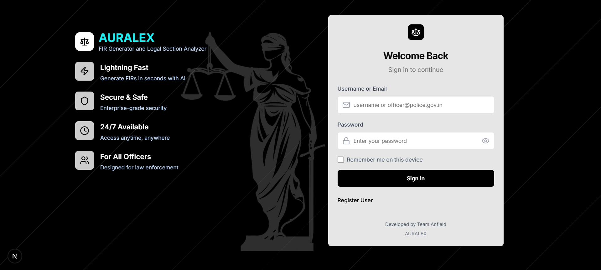
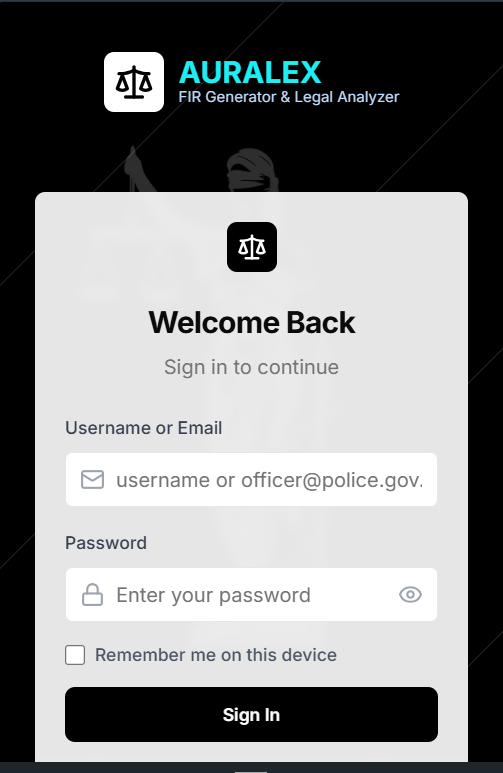

# AURALEX — FIR Generator & Legal Analyzer

A compact tool that converts spoken incident descriptions into structured First Information Reports (FIR) and suggests relevant Indian legal sections using a Retrieval-Augmented Generation (RAG) approach.

What's in this repo
- Next.js frontend (app/)
- Python audio backend (backend/audio.py) — Fast-Whisper + FastAPI
- IPC/CrPC prediction and analysis code - [AURALEX BACKEND](https://github.com/Prabhav04/Auralex-Backend)

Quick goals
- Fast local dev: run the frontend and the audio backend separately
- Transcribe audio via the backend POST /transcribe (multipart file field: `file`)

Prerequisites
- Node.js 18+ and npm
- Python 3.10+ and virtualenv
- ffmpeg (recommended) for some audio formats

Frontend (quick start)
1. From the project root:

```powershell
npm install
npm run dev
```

2. Open the app in your browser:

- https://localhost:3000 (the project may run with HTTPS enabled) or http://localhost:3000

Firebase Authentication (frontend setup)
1. Create a Firebase project at https://console.firebase.google.com and add a Web app.
2. Copy the web app config values and create a `.env.local` file in the project root with the keys below (restart the dev server after adding env vars):

```ini
NEXT_PUBLIC_FIREBASE_API_KEY=your_api_key
NEXT_PUBLIC_FIREBASE_AUTH_DOMAIN=your-project.firebaseapp.com
NEXT_PUBLIC_FIREBASE_PROJECT_ID=your_project_id
NEXT_PUBLIC_FIREBASE_STORAGE_BUCKET=your_project.appspot.com
NEXT_PUBLIC_FIREBASE_MESSAGING_SENDER_ID=your_messaging_sender_id
NEXT_PUBLIC_FIREBASE_APP_ID=your_app_id
```

Audio backend (quick start)
1. Create and activate a Python virtual environment (PowerShell):

```powershell
python -m venv .venv; .\.venv\Scripts\Activate.ps1
```

2. Install the minimal backend requirements (this project includes a small `requirements.txt`):

```powershell
pip install -r requirements.txt
```

3. Run the backend from the `backend` folder:

```powershell
cd backend; uvicorn audio:app --reload --host 0.0.0.0 --port 8000
```

4. Health-check (browser or curl):

```powershell
curl http://127.0.0.1:8000/
# expected: {"status":"Fast-Whisper backend running"}
```

Transcription endpoint (usage example)
- POST a multipart/form-data with the audio file using field `file` to `/transcribe`.

Example curl (local):

```powershell
curl -X POST "http://127.0.0.1:8000/transcribe" -F "file=@sample.webm"
```

Notes & tips
- The backend uses `faster_whisper` and will download / use an internal model. Ensure the machine has enough disk space and required runtime dependencies.
- If you see audio decoding errors, install ffmpeg and retry.
- For production deployments, run the frontend and backend behind proper HTTPS and add CORS/security rules accordingly.

Minimal project structure
- app/ — Next.js app (frontend)
- backend/audio.py — FastAPI service that transcribes audio using Faster-Whisper
- components/, lib/, styles/ — frontend helpers

Project contributors
- [R Harikrishnan](https://github.com/harikrishnan669)
- [Prabhav Narayanan](https://github.com/Prabhav04)
- [Dipesh V Sabu](https://github.com/tanx314)
- [Muhammed Jaseel T A](https://github.com/Jaseel29)

Demo


User Interface

| Desktop                               | Mobile                              |
|---------------------------------------|-------------------------------------|
|  |  |


